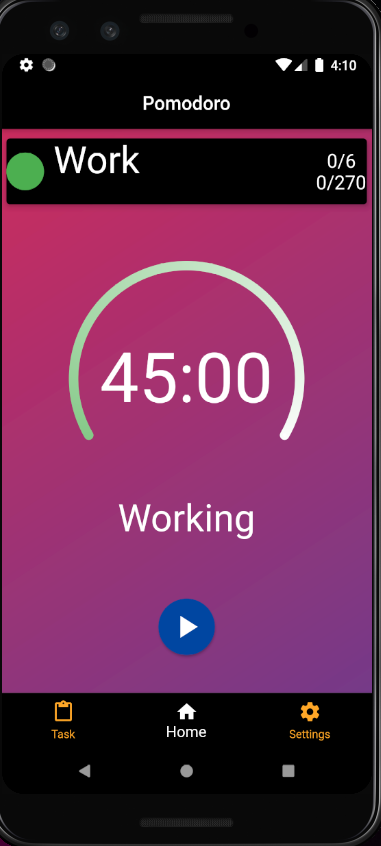
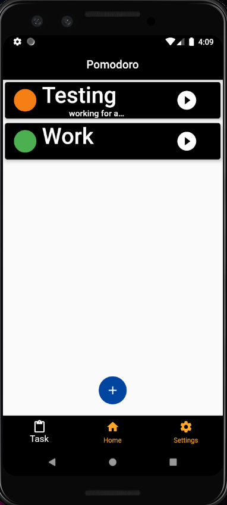
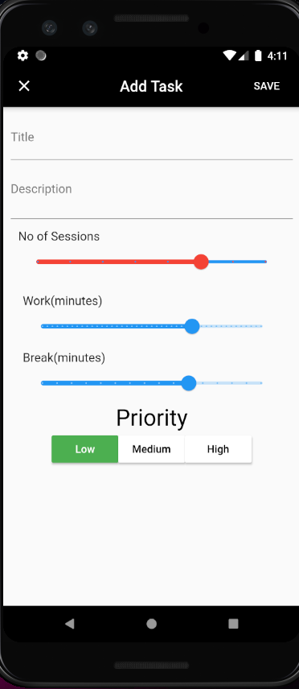
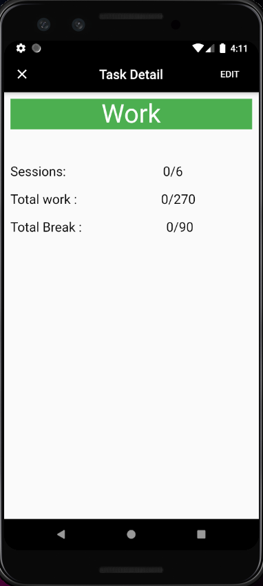

# PomodoroApp

A new Flutter project.
Time Management app to manage time and increase productivity by breaking work into intervals.
App aims to provide interface to manage tasks.

## what is Pomodoro technique ?
The pomodoro technique is a time management technique uses a time to break down work into intervals. Traditionally 25 minutes length, separated by short breaks. 

##Screen
<!--  -->
 
 
 
 